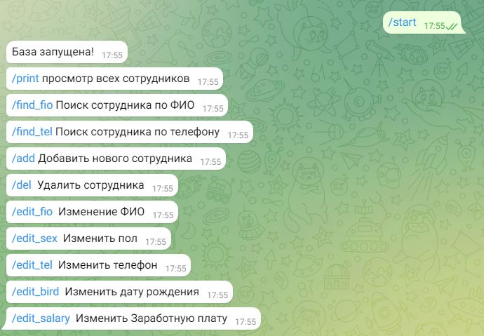
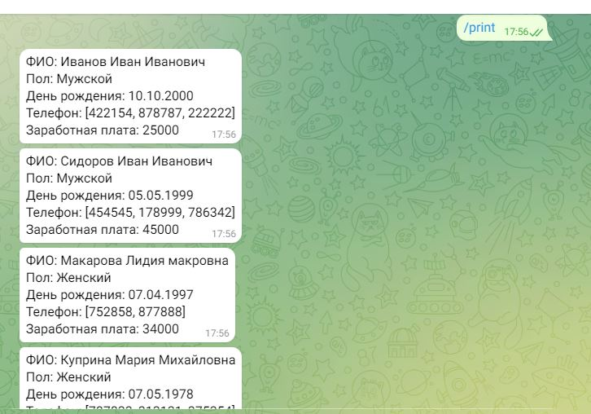
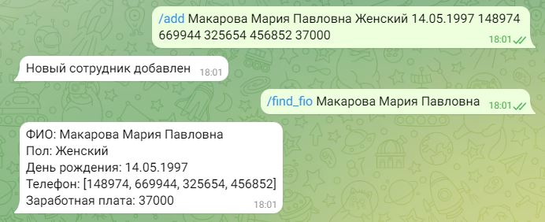
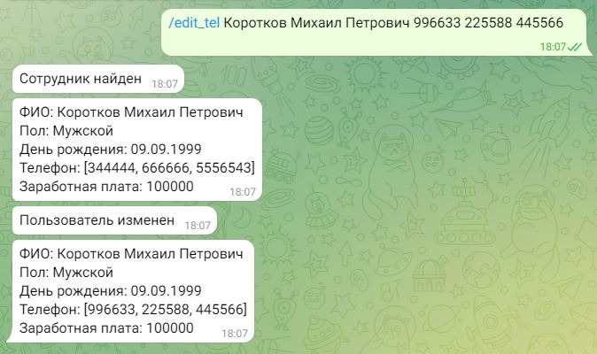
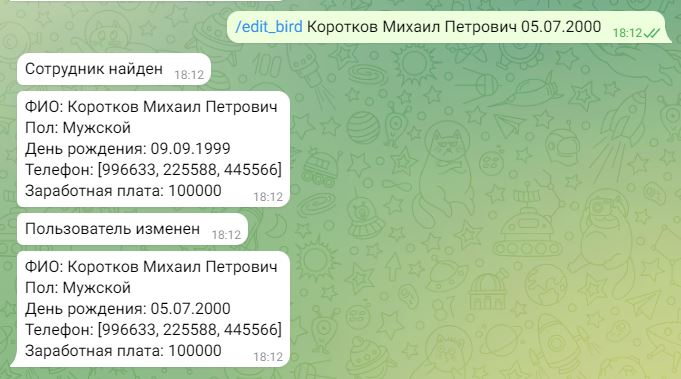
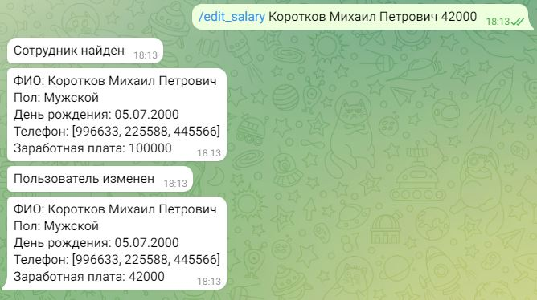

# Телеграмм бот База данных с внешним хранилищем

## Логика работы ##

### Используемые модули ###

telebot

## Модуль baza. ##

Функция *save_bd* сохраняет базу в файл .jason
Функция *read_bd* Считывает базу из файла и возвращает ее.

## Модуль dictionary. ##

В этом модуле лежит список отвечающий за пол сотрудника

## Модуль print_data. ##

Принимает ключ и его данные из словоря и переводит все в одно строковое значение отформатировано для удобства восприятия.

## Модуль menu. ##

Функция *start_message* Ждет команду start читает базу из файла в память и выводит список поддерживаемых команд

Функция *rint_message* Ждет команду print выводит всех сотрудников

Функция *findfio_message* Ждет команду find_fio ищет сотрудников по фамилии имю и отчеству. Ищет не точное совпадение, соответственно можно искать отдельно по фамилии имени и отчеству

Функция *findtel_message* Ждет команду find_tel Ищет сотрудников по номеру телефона. Ищет по точному совпадению

Функция *add_message* Ждет команду add добовляет нового сотрудника

Функция *del_message* Ждет команду del удаляет сотрудника

Функция *editfio_message* Ждет команду edit_fio изменение ФИО у сотрудника

Функция *editsex_message* Ждет команду edit_sex изменение пола у сотрудника

Функция *edittel_message* Ждет команду edit_tel изменение телефона у сотрудника

Функция *editbird_message* Ждет команду edit_bird изменение даты рождения у сотрудника

Функция *editsalary_message* Ждет команду edit_salary изменение заработной платы у сотрудника

Функция *editsalary_message* Ждет команду edit_salary изменение заработной платы у сотрудника

## Работа бота ##

+ /start - *Загружает базу из файла и предлагает список поддерживаемых комманд* 

+ /print - *Показывает всех сотрудников*

+ /find_fio - *Осуществляет поиск сотрудника по ФИО. Вводить нужно* (/find_fio Фамилия Имя Отчество), Данные вводятся через пробел *Ищет по совпадениям символов. Можно искать отдельно по имини по фамилии или по отчеству* 

+ /find_tel - *Осуществляет поиск сотрудника по телефону. Вводить нужно* (/find_tel телефон) *Ищет по полному совпадению номера.*

+ /add - *Добавляет нового сотрудника Вводить* (/add Фамилия Имя Отчество (ФИО разделяется пробелом(Пример: Иванов Иван Иванович) пол (Мужской или женский) дата рождения(Формат дд.мм.гггг) телефон (Можно вводить несколько, телефон вводится без пробело. Если несколько телефонов они отделяются пробелами)  Зарабатная плата (Пример: 20000)))

+ /del - *Удаление сотрудника. Команда ищет полное совпадение ФИО* Вводить /del Иванов Иван Иванович

+ /edit_fio - *Изменение ФИО.* Вводить /del Иванов Иван Иванович Иванов Иван Федорович *Пишем команду ФИО старое и ФИО новое. Ищет по полному совпадению ФИО*

+ /edit_sex - *Изменение пола.* Вводить /edit_sex Иванов Иван Иванович мужской *Пишем команду ФИО и новый пол. Ищет по полному совпадению ФИО*

+ /edit_tel - *Изменение телефона.* Вводить /edit_tel Иванов Иван Иванович 89874545451 232323 *Пишем команду ФИО и новые телефоны через пробел. Ищет по полному совпадению ФИО. Заменяет все старые телефоны*

+ /edit_bird - *Изменение даты рождения.* Вводить /edit_bird Иванов Иван Иванович 05.05.1999 *Пишем команду ФИО и новую дату рождения. Ищет по полному совпадению ФИО.*

+ /edit_salary - *Изменение заработной платы.* Вводить /edit_salary Иванов Иван Иванович 50000 *Пишем команду ФИО и новую заработную плату. Ищет по полному совпадению ФИО.*
